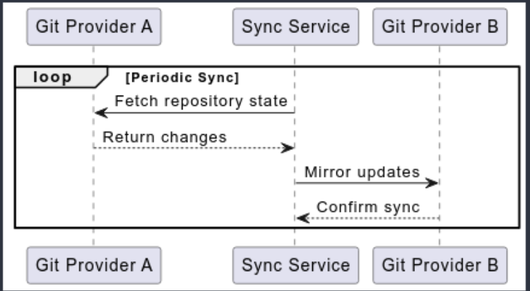
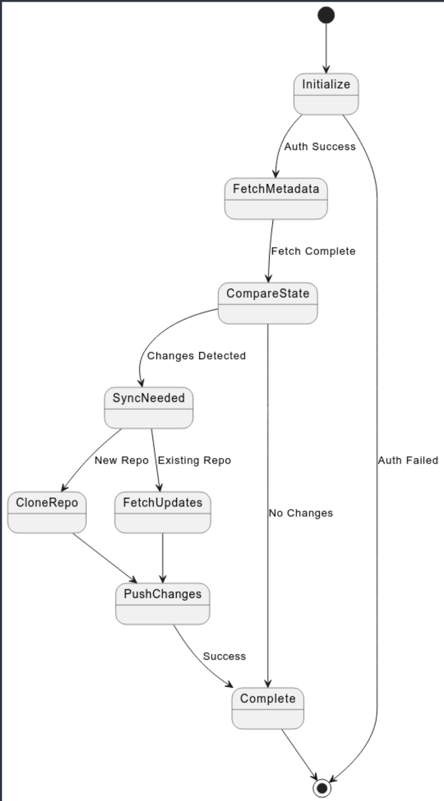

// SPDX-FileCopyrightText: 2025 The Git Provider Sync Authors
//
// SPDX-License-Identifier: CC0-1.0

= Git Provider Sync Architecture

== Introduction

Primary capabilities:
* Mirror repositories between different Git providers
* Batch clone repositories to local storage
* Archive repositories into compressed files
* Support multiple source and target configurations

Quality goals:
* Security: Limited token access, OpenSSF best practices
* Reliability: Error handling, validation, retry support
* Maintainability: Modular providers, testing

== Constraints

Technical:
* Go 1+
* Git 2.43+
* Provider API limitations and rate limits

Organizational:
* EUPL 1.2 License
* REUSE specification
* Conventional Commits
* DCO requirement

== System Context

Business context:
* Backup and redundancy across providers
* Migration support between platforms
* Cross-platform development workflows

Technical context:
* GitHub API v3 (OAuth tokens)
* GitLab API v4 (Personal access tokens)
* Gitea API v1 (Access tokens)
* HTTP/SSH authentication support

== Solution Strategy

* Provider abstraction: Common interface, extensible for new providers
* Configuration: Hierarchical sources with environment variable support
* Sync process: State-based with validation and retry mechanisms
* Security: Token-based auth with limited scope access

== Building Blocks

[source]
----
Git Provider Sync
├── Provider System
│   ├── GitHub Provider
│   ├── GitLab Provider
│   └── Gitea Provider
├── Target System
│   ├── Git Providers
│   ├── Archive Target
│   └── Directory Target
├── Configuration Management
└── Sync Engine
----

* Provider System: API interactions, authentication, provider-specific features
* Target System: Repository destinations, target-specific operations
* Configuration: Multiple sources, validation, environment variables
* Sync Engine: Coordination, state management, retry logic

== Runtime View

ifndef::env-vscode[]

endif::[]

ifdef::env-vscode[]
[plantuml]
----
@startuml
participant "Git Provider A" as GH
participant "Sync Service" as Sync
participant "Git Provider B" as GL

loop Periodic Sync
    Sync -> GH: Fetch repository state
    GH --> Sync: Return changes
    Sync -> GL: Mirror updates
    GL --> Sync: Confirm sync
end
@enduml
----
endif::[]

The sequence diagram above illustrates the core synchronization process at its highest level:

.1. Periodic Sync Loop
* The process runs either on schedule or manual trigger
* Each iteration handles the complete sync cycle

.2. Core Interactions
* Fetch: Get current state and changes from source provider
* Process: Handle the returned changes internally
* Mirror: Push updates to target provider
* Verify: Confirm successful synchronization

.3. Communication Pattern
* Synchronous request-response pattern
* Provider-agnostic interface

=== 6.2 Detailed Sync Process Flow

ifndef::env-vscode[]

endif::[]

ifdef::env-vscode[]
[plantuml]
----
@startuml
state "Initialize" as Init
state "FetchMetadata" as Fetch
state "CompareState" as Compare
state "SyncNeeded" as Sync
state "CloneRepo" as Clone
state "FetchUpdates" as Updates
state "PushChanges" as Push
state "Complete" as Done

[*] --> Init
Init --> Fetch : Auth Success
Init --> [*] : Auth Failed

Fetch --> Compare : Fetch Complete

Compare --> Sync : Changes Detected
Compare --> Done : No Changes

Sync --> Clone : New Repo
Sync --> Updates : Existing Repo

Clone --> Push
Updates --> Push

Push --> Done : Success

Done --> [*]
@enduml
----
endif::[]

.1. Authentication & Setup
* Initialize API connections
* Validate credentials

.2. Repository Discovery
* List repositories
* Apply filters

.3. State Comparison
* Fetch metadata
* Compare states

.4. Sync Process
* Clone/fetch repositories
* Process changes
* Push updates

.5. Validation
* Update status

=== 6.3 Implementation Details

The runtime view implementation follows hexagonal architecture principles:

* **Command Layer**: CLI commands (`cmd/`) handle user interface and orchestrate domain operations
* **Domain Layer**: Contains core business logic for synchronization workflows
* **Adapter Layer**: Implements external integrations (Git providers, filesystem, logging)
* **Dependency Injection**: Container manages component lifecycle and dependencies

== Deployment

Deployment options:
* Local execution
* CI/CD pipelines (GitHub Actions, GitLab CI)
* Container deployments
* Kubernetes CronJobs

== Implementation Notes

Architecture decisions:
* Go: Concurrency, cross-platform, strong stdlib
* Modular providers: Extensible, common interfaces
* Configuration hierarchy: Multiple sources, clear precedence

Quality focus:
* Security: Token management, vulnerability scanning
* Reliability: Error handling, retry mechanisms
* Maintainability: Automated testing, quality checks

Current status: Alpha stage with evolving architecture

== Glossary

Git Provider:: Service hosting git repositories (GitHub, GitLab, Gitea)
Sync Service:: Core synchronization service
Target:: Destination for synchronized repositories
DCO:: Developer Certificate of Origin
REUSE:: Standard for license compliance