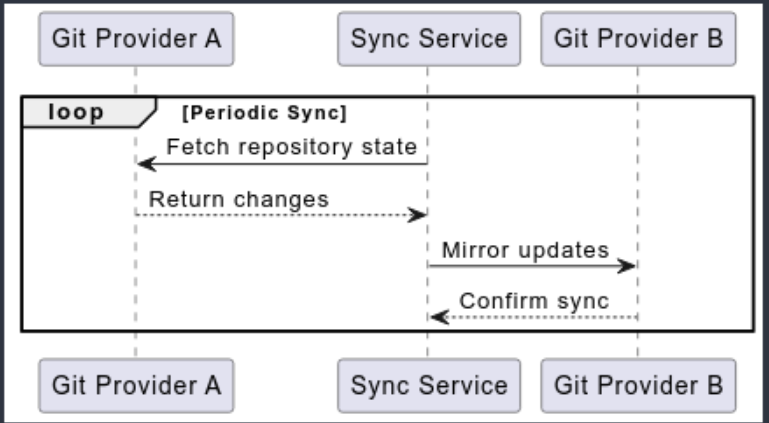
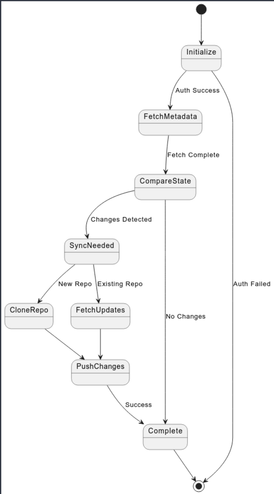

// SPDX-FileCopyrightText: Josef Andersson
//
// SPDX-License-Identifier: CC0-1.0

= Git Provider Sync - Software Architecture Documentation

== 1. Introduction and Goals

=== 1.1 Requirements Overview

.Primary capabilities:
* Mirror repositories between different Git providers
* Batch clone repositories to local storage
* Archive repositories into compressed files
* Support multiple source and target configurations

=== 1.2 Quality Goals

.1. Security
* Limited token access
* Security scanning integration
* OpenSSF best practices compliance

.2. Reliability
* Error handling for sync operations
* Validation of sync states
* Support for retries

.3. Maintainability
* Modular provider system
* Comprehensive testing
* Quality assurance automation

=== 1.3 Stakeholders

* Developers using multiple git providers
* Organizations needing repository mirroring
* DevOps teams managing git infrastructure
* Open source contributors

== 2. Architecture Constraints

=== 2.1 Technical Constraints

* Go version 1.26+
* Git 2.43+
* Provider-specific API limitations
* Rate limiting considerations

=== 2.2 Organizational Constraints

* EUPL 1.2 License compliance
* REUSE specification compliance
* Conventional Commits standard
* Developer Certificate of Origin (DCO) requirement

== 3. System Scope and Context

=== 3.1 Business Context

The system operates in an environment where there is a need to maintain repository synchronization across Git providers.
This could be for various reasons:

.1. Backup and Redundancy
* Maintaining copies of repositories across different providers
* Creating local backups for disaster recovery
* Archiving repositories for compliance

.2. Migration Support
* Facilitating provider transitions
* Supporting multi-provider strategies
* Enabling gradual migrations

.3. Cross-Platform Development
* Supporting development across different Git platforms
* Maintaining mirrors for different user groups
* Enabling platform-specific features while maintaining synchronization

The context diagram above illustrates the key interactions between the system and its environment.

=== 3.2 Technical Context

The system has support for interacting with various external systems through different interfaces:

.1. Git Provider APIs
[source,yaml]
----
GitHub API:
  - Example Base URL: api.github.com
  - Version: v3
  - Auth: OAuth tokens
  
GitLab API:
  - Example Base URL: gitlab.com/api
  - Version: v4
  - Auth: Personal access tokens
  
Gitea API:
  - Example Base URL: <instance>/api
  - Version: v1
  - Auth: Access tokens
----

.2. Authentication Methods
[source,yaml]
----
HTTP:
  - Token-based authentication
  - Rate limit considerations
  - API-specific headers

SSH:
  - Key-based authentication
  - SSH Command support
  - Custom SSH configurations
----

== 4. Solution Strategy

.Key architectural decisions:

.1. Provider Abstraction
* Modular
* Common interface for different git providers
* Extensible for new providers

.2. Configuration Management
* Hierarchical configuration system
* Multiple configuration sources
* Environment variable support

.3. Sync Process
* State-based synchronization
* Validation steps
* Error handling and retry mechanisms

.4. Security
* Token-based authentication
* Limited scope access

== 5. Building Block View

=== 5.1 Level 1: System Overview

.Main components:
[source]
----
Git Provider Sync
├── Provider System
│   ├── GitHub Provider
│   ├── GitLab Provider
│   └── Gitea Provider
├── Target System
│   ├── Git Providers
│   ├── Archive Target
│   └── Directory Target
├── Configuration Management
└── Sync Engine
----

=== 5.2 Level 2: Component Details

==== Provider System
* Handles provider-specific API interactions
* Manages authentication
* Implements provider-specific features

==== Target System
* Manages repository destinations
* Handles different target types
* Implements target-specific operations

==== Configuration Management
* Processes multiple config sources
* Validates configurations
* Manages environment variables

==== Sync Engine
* Coordinates sync operations
* Handles state management
* Implements retry logic

== 6. Runtime View

=== 6.1 High-Level Process Overview

ifndef::env-vscode[]

endif::[]

ifdef::env-vscode[]
[plantuml]
----
@startuml
participant "Git Provider A" as GH
participant "Sync Service" as Sync
participant "Git Provider B" as GL

loop Periodic Sync
    Sync -> GH: Fetch repository state
    GH --> Sync: Return changes
    Sync -> GL: Mirror updates
    GL --> Sync: Confirm sync
end
@enduml
----
endif::[]

The sequence diagram above illustrates the core synchronization process at its highest level:

.1. Periodic Sync Loop
* The process runs either on schedule or manual trigger
* Each iteration handles the complete sync cycle

.2. Core Interactions
* Fetch: Get current state and changes from source provider
* Process: Handle the returned changes internally
* Mirror: Push updates to target provider
* Verify: Confirm successful synchronization

.3. Communication Pattern
* Synchronous request-response pattern
* Provider-agnostic interface

=== 6.2 Detailed Sync Process Flow

ifndef::env-vscode[]

endif::[]

ifdef::env-vscode[]
[plantuml]
----
@startuml
state "Initialize" as Init
state "FetchMetadata" as Fetch
state "CompareState" as Compare
state "SyncNeeded" as Sync
state "CloneRepo" as Clone
state "FetchUpdates" as Updates
state "PushChanges" as Push
state "Complete" as Done

[*] --> Init
Init --> Fetch : Auth Success
Init --> [*] : Auth Failed

Fetch --> Compare : Fetch Complete

Compare --> Sync : Changes Detected
Compare --> Done : No Changes

Sync --> Clone : New Repo
Sync --> Updates : Existing Repo

Clone --> Push
Updates --> Push

Push --> Done : Success

Done --> [*]
@enduml
----
endif::[]

.1. Authentication & Setup
* Initialize API connections
* Validate credentials

.2. Repository Discovery
* List repositories
* Apply filters

.3. State Comparison
* Fetch metadata
* Compare states

.4. Sync Process
* Clone/fetch repositories
* Process changes
* Push updates

.5. Validation
* Update status

=== 6.3 Implementation Details

To-Do

== 7. Deployment View

=== 7.1 Infrastructure

.Supports deployment as:
* CLI application
* Container in CI/CD systems
* Scheduled job (cron)
* Manual trigger

=== 7.2 CI/CD Integration

.Supported platforms:
* GitLab CI
* GitHub Actions
* Tekton
* Kubernetes CronJobs

== 8. Cross-cutting Concepts

=== 8.1 Development Concepts

* Test-driven development
* Comprehensive quality checks
* Security-first approach
* Open source best practices

=== 8.2 Security Concepts

* Limited token access
* Signed commits
* Security scanning
* Vulnerability checking

== 9. Architecture Decisions

.1. Use of Go for implementation
* Strong standard library
* Built-in concurrency support
* Cross-platform compatibility

.2. Modular provider system
* Extensibility
* Provider-specific implementations
* Common interfaces

.3. Configuration hierarchy
* Multiple configuration sources
* Clear precedence rules
* Environment variable support

== 10. Quality Requirements

=== 10.1 Quality Scenarios

.1. Security
* Regular vulnerability scanning
* Automated security checks
* OpenSSF Scorecard compliance

.2. Maintainability
* Automated testing
* Code quality checks
* Documentation requirements

.3. Reliability
* Error handling
* State validation
* Retry mechanisms

== 11. Risks and Technical Debt

=== 11.1 Risks

.1. API Changes
* Provider API changes
* Rate limiting changes
* Authentication changes

.2. Security
* Token management
* Provider access control
* Data integrity

=== 11.2 Technical Debt

.1. Current Status
* Alpha stage software
* Potential breaking changes
* Evolving architecture

.2. Mitigation
* Comprehensive testing
* Quality automation
* Security scanning

== 12. Glossary

Git Provider:: A service hosting git repositories (GitHub, GitLab, Gitea)
Sync Service:: The core synchronization service
Target:: Destination for synchronized repositories
DCO:: Developer Certificate of Origin
REUSE:: A standard for license compliance